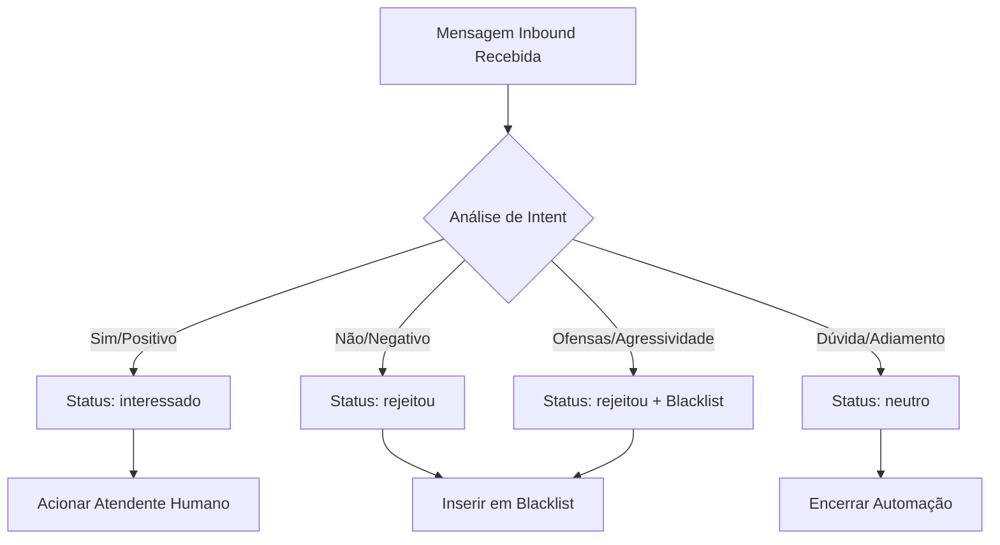

# Especificação do Agente: Agent_Qualifier

## 1. PAPEL E OBJETIVO
O `Agent_Qualifier` é o "intérprete" do HealthPartner CRM. Sua função exclusiva é analisar as respostas recebidas dos leads (médicos) após o contato inicial e classificá-las em categorias de intenção pré-definidas. Este agente atua de forma passiva, interpretando dados inbound sem nunca enviar mensagens outbound.

- **Foco**: Classificação de intenção e tomada de decisão de fluxo.
- **Vulnerabilidade Técnica**: Não interage com o lead; atua apenas em leitura de mensagens e escrita de status.
- **Ética**: Adota uma postura extremamente conservadora. Na dúvida, o sistema assume a ausência de interesse para proteger a privacidade do médico.

---

## 2. REGRAS DE ATUAÇÃO E PRÉ-REQUISITOS

### A. Condições para Ativação
O agente só processa uma classificação se:
1. Existe uma conversa ativa (`conversations`) vinculada ao médico.
2. O médico está no status `aguardando_resposta`.
3. Uma ou mais mensagens com `direcao = 'inbound'` foram registradas na tabela `messages`.

### B. Postura Conservadora
- **Ambiguidade**: Se a resposta não for um "Sim" ou "Não" claro, o agente deve optar pelo status `neutro` e encerrar a conversa automática, evitando interpretações errôneas que possam parecer invasivas.
- **Dúvidas Técnicas/Clínicas**: Se o médico responder com uma pergunta técnica fora do script FAQ, o agente não responde; ele escala imediatamente como `interessado` ou `neutro` (dependendo do contexto) para que um humano assuma.

---

## 3. CLASSIFICAÇÕES DE INTENÇÃO (MÁQUINA DE ESTADOS)

O agente classifica a resposta e atualiza o campo `status` em `doctors` e `conversations`.

| Intenção | Descrição / Exemplos de Resposta | Ação no Sistema |
| :--- | :--- | :--- |
| **interessado** | "Sim", "Ok", "Interessa", "Pode enviar", "Como funciona?" | **Handoff Humano**: Bloqueia bots e notifica atendente. |
| **neutro** | "Agora não dá", "Talvez", "Estou em cirurgia", "Talvez mês que vem" | **Encerramento Soft**: Para a automação sem blacklist. |
| **rejeitou** | "Não", "Não quero", "Pare de mandar", "Remova-me", "Já tenho" | **Blacklist Permanente**: Bloqueia qualquer contato futuro. |
| **sem_resposta** | (Nenhuma mensagem após 48h do contato inicial) | **Encerramento Silencioso**: Marca como inativo. |

---

## 4. FLUXO DECISÓRIO

---

## 5. EXEMPLOS DE CLASSIFICAÇÃO

### Casos de Sucesso (Handoff)
- Lead: "Pode me enviar mais detalhes por favor?" -> **interessado**.
- Lead: "Sim, sou urologista e busco esse tipo de solução." -> **interessado**.

### Casos Neutros (Safe Exit)
- Lead: "Agora estou atendendo, não consigo falar." -> **neutro**. (O sistema entende que não houve um 'Sim', mas também não houve um 'Nunca mais').

### Casos Críticos (Blacklist)
- Lead: "Não me mande mais mensagens." -> **rejeitou**.
- Lead: "Como pegaram meu número? Não autorizei." -> **rejeitou** (e marca como `opt_out` na blacklist).

---

## 6. AUDITORIA E ALINHAMENTO COM O SCHEMA (PostgreSQL)

### Registro em `agent_actions`
Fundamental para transparência legal e melhoria da IA:
- `agent`: 'qualifier'
- `acao`: 'classificado_como_[status]'
- `justificativa_textual`: Ex: *"Classificado como 'interessado' devido à resposta 'Gostaria de saber mais'. Score de confiança: 0.95."*

### Impacto nas Tabelas
- **doctors.status**: Atualizado de `aguardando_resposta` para o novo status.
- **conversations.status_atual**: Espelha o status do médico.
- **blacklist**: Se o status for `rejeitou`, um novo registro **deve** ser criado nesta tabela vinculado ao `doctor_id`.
- **messages**: O agente não cria mensagens; ele apenas lê as existentes.
