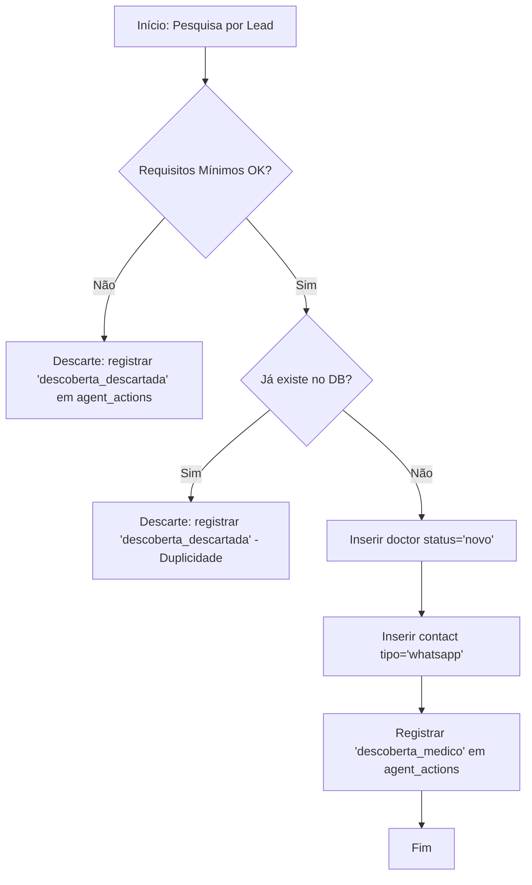

# Especificação do Agente: Agent_Researcher

## 1. PAPEL E OBJETIVO
O `Agent_Researcher` é a porta de entrada de dados do HealthPartner CRM. Sua função é localizar profissionais de saúde em fontes públicas, validar a natureza comercial dos contatos e alimentar a fundação do banco de dados para os processos subsequentes.

- **Foco**: Descoberta e captação inicial.
- **Vulnerabilidade Técnica**: Não realiza automação de mensagens; atua apenas em leitura e escrita de dados.
- **Ética**: Respeita a publicidade dos dados, ignorando contatos de natureza privada ou pessoal.

---

## 2. LÓGICA DE FUNCIONAMENTO (WORKFLOW)

### A. Descoberta e Filtro de Fonte
1. O agente foca em uma região e especialidade alvo (ex: Urologistas em São Paulo).
2. Varre fontes permitidas (Google Maps, sites institucionais).
3. Identifica a presença de um profissional individual vinculado àquela fonte.

### B. Validação de Requisitos Mínimos
Para cada perfil encontrado, o agente verifica:
- **Nome**: Identificável e completo?
- **Especialidade**: É condizente com o objetivo?
- **WhatsApp**: Existe um número comercial ou funcional com indicação clara de WhatsApp?
- **Fonte**: A origem é rastreável e pública?

### C. Processo de Deduplicação
Antes de qualquer escrita:
1. Consulta a tabela `doctors` por `nome_completo` + `especialidade`.
2. Se houver correspondência, verifica a tabela `contacts` para ver se o valor identificado já existe.
3. Se o registro for duplicado, o agente **não insere** e registra apenas a auditoria de descoberta descartada.

---

## 3. EXEMPLOS OPERACIONAIS

### Registros VÁLIDOS (Aprovados para Inserção)
- **Cenário 1**: Perfil no Google Maps de "Clínica Uro-Vida - Dr. Ricardo Silva", com número fixo e celular marcado como "WhatsApp Comercial".
- **Cenário 2**: Site institucional do Hospital Israelita listando "Dra. Ana Costa - Urologista" com link direto para agendamento via WhatsApp.

### Registros INVÁLIDOS (Descarte Imediato)
- **Cenário A**: Lista de CRM sem nenhum meio de contato comercial identificado.
- **Cenário B**: Celular de médico extraído de perfil pessoal de rede social (sem contexto clínico/comercial).
- **Cenário C**: Perfil de clínica que não cita um profissional específico por nome.

---

## 4. PSEUDO-FLUXO DE DECISÃO

---

## 5. REGRAS DE ESCRITA E AUDITORIA

### Banco de Dados (PostgreSQL)
- **doctors**: Status inicial é **sempre** `novo`. O campo `fonte_publica` deve conter o link ou nome da fonte para rastreabilidade legal.
- **contacts**: O primeiro WhatsApp inserido deve ser marcado como `principal=TRUE` e `verificado=FALSE`.
- **agent_actions**: Absolutamente obrigatório. A `justificativa_textual` deve descrever por que o médico foi considerado válido. Ex: *"Identificado via listagem pública do Google Maps vinculada à Clínica X"*.

---

## 6. ALINHAMENTO COM O SCHEMA
- O agente utiliza o ENUM `agent_type` valor `researcher`.
- As inserções respeitam as `Foreign Keys` e restrições de unicidade definidas no arquivo `schema_postgresql.sql`.
- O agente não toca nas tabelas `conversations` ou `messages`.
- O agente consulta a `blacklist` antes de tentar inserir um novo lead para garantir que não está reintroduzindo alguém que solicitou exclusão.
