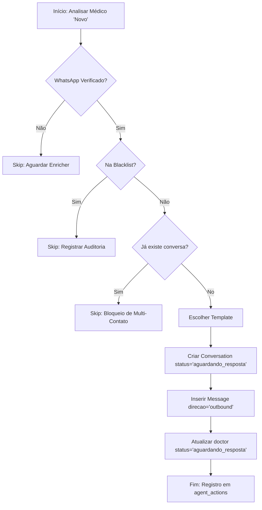

# Especificação do Agente: Agent_Contact_WhatsApp

## 1. PAPEL E OBJETIVO
O `Agent_Contact_WhatsApp` é o responsável exclusivo por realizar a primeira abordagem automatizada do HealthPartner CRM. Sua atuação é pautada pelo minimalismo, profissionalismo e conformidade absoluta com as políticas de anti-spam da Meta e a LGPD.

- **Foco**: Iniciação de canal profissional.
- **Vulnerabilidade Técnica**: Não responde a mensagens de leads; não faz follow-up.
- **Ética**: Respeita o silêncio do médico. Se não houver resposta, o agente nunca insiste.

---

## 2. REGRAS DE ATUAÇÃO E RESTRIÇÕES

### A. Limite de Contato
- O agente envia **EXATAMENTE UMA** mensagem automática por vida de um lead no CRM.
- Proibição total de mensagens de "relembre" ou follow-up.

### B. Critérios de Blindagem (Pre-flight Check)
Antes de disparar qualquer mensagem, o sistema verifica:
1. **Status**: O médico deve estar em `status = 'novo'`.
2. **Qualidade**: O contato WhatsApp deve estar marcado como `verificado = TRUE` (pelo Agent Enricher).
3. **Blacklist**: O médico ou o número não podem constar na lista de exclusão.
4. **Histórico**: Não pode existir nenhuma entrada na tabela `conversations` para este médico no canal WhatsApp.

### C. Identificação
O agente nunca finge ser humano. O tom é institucional e neutro.

---

## 3. FLUXO DE DECISÃO (SEND/SKIP)

---

## 4. TEMPLATES PERMITIDOS

O agente utiliza apenas os seguintes templates, substituindo as variáveis `{{nome}}` e `{{especialidade}}`.

1. **Padrão**: "Olá, Dr(a). {{nome}}. Somos da equipe HealthPartner. Estamos entrando em contato para apresentar uma parceria profissional voltada à área de {{especialidade}}. Caso seja do seu interesse, fico à disposição para explicar melhor."
2. **Conservador**: "Bom dia, Dr(a). {{nome}}. Este é um contato institucional da HealthPartner. Gostaríamos de saber se podemos apresentar uma proposta profissional relacionada à sua especialidade."
3. **Contextual**: "Olá, Dr(a). {{nome}}. Identificamos sua atuação em {{especialidade}} através de informações públicas. Gostaríamos de saber se podemos enviar uma breve apresentação institucional."

---

## 5. EXEMPLOS OPERACIONAIS

### Cenário 1: ENVIO VÁLIDO
- Médico: Dr. João Urologista. Status: `novo`. WhatsApp: Validado pelo Enricher. Nenhuma conversa anterior.
- **Ação**: Cria conversa, envia template Padrão, atualiza status para `aguardando_resposta`, registra ação em `agent_actions`.

### Cenário 2: BLOQUEIO (Skip)
- Médico: Dra. Maria. Status: `novo`. WhatsApp: Capturado pelo Researcher mas **não verificado** (verificado=FALSE).
- **Ação**: O agente ignora o registro até que o `Agent_Enricher` realize a validação cruzada.

---

## 6. AUDITORIA E ALINHAMENTO COM O SCHEMA (PostgreSQL)

### Registro de Decisão
Toda tentativa frustrada ou bem-sucedida gera uma entrada em `agent_actions`:
- `agent`: 'contact_whatsapp'
- `acao`: 'mensagem_inicial_enviada' ou 'envio_abortado'.
- `justificativa_textual`: Ex: *"Template Padrão enviado para WhatsApp principal (119XXXXXXXX)"* ou *"Envio abortado: lead consta na blacklist"*.

### Operação Atômica no Banco
1. Inserção em `conversations` (id único por `doctor_id` + `canal`).
2. Inserção em `messages` (id original da mensagem no broker, se disponível).
3. Atualização de `doctors.status` para `aguardando_resposta`.

Este processo garante que, em caso de falha no passo 3, o passo 4 (tentativa de re-envio) seja impedido pela existência da conversa no passo 1.
